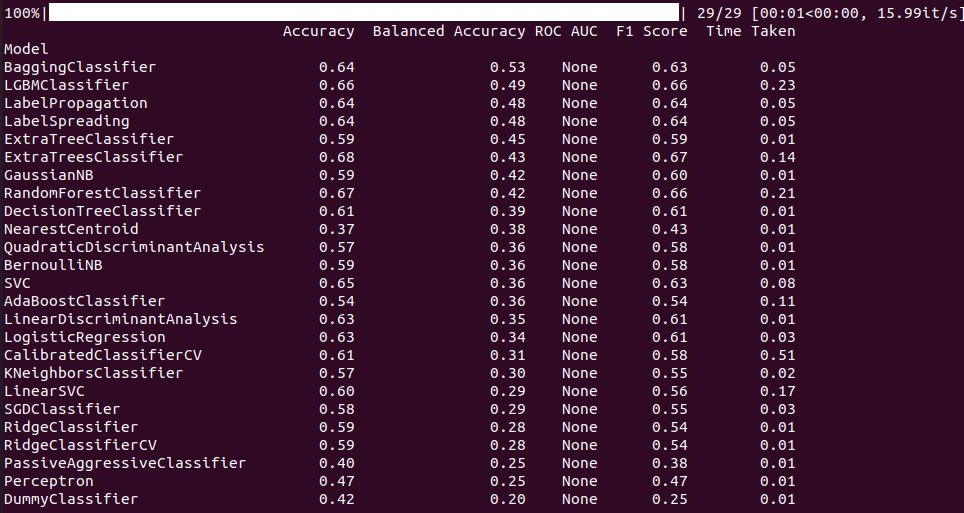
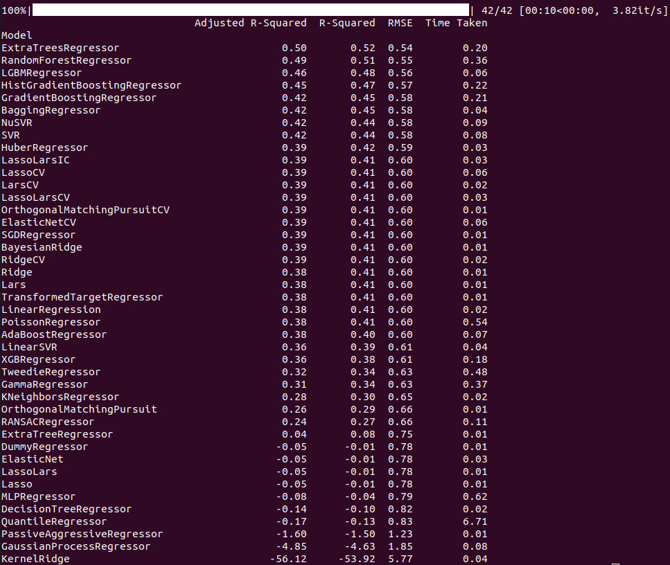

<<<<<<< HEAD
# Wine-Quality-Predictiongit
=======
# Wine-Quality-Prediction

## Choix du modèle

### Régression Linéaire
Pour le choix du modèle, nous étions parties dans un premier temps sur une régression linéaire. L'accuracy était très mauvaise (~ 38%). Même après un nettoyage de données qui remplaçaient les valeurs aberrantes par la médiane, l'accuracy restait mauvaise. Ainsi, nous avons décidé de supprimer une à une les variables les moins significatives et de recréer des modèles. Rien y fait, l'accuracy a atteint maximum 42%.

### Lazy predict Classification VS Régression
Ainsi, nous avons utilisé la librairie lazypredict dans un premier temps pour les régressions. Celle-ci permet de calculer l'accuracy pour chaque modèle de Machine Learning. Aucun modèle de régression ne donnait des résultats au delà de 50% d'accuracy. En revance, lazy predict pour les classifications donnait des précisions bien meilleures avec des modèles comme la méthode des forêts aléatoires pour la classification qui atteint presque 70%.

#### Lazy predict pour les classifications

#### Lazy predict pour les régressions

C'est pourquoi nous nous sommes orientées vers une classification via les forêts aléatoires (RandomForestClassifier). Pour cela, nous utilisons la librairies Scikit-Learn qui "fournit une sélection d'outils efficaces pour l'apprentissage automatique et la modélisation statistique, notamment la classification, la régression et le clustering via une interface cohérente en Python".
>>>>>>> origin/modele_ML
